# python-api-challenge
Using Python requests, APIs, and JSON traversals to answer questions about the weather.

## Part I - WeatherPy
The [WeatherPy Notebook](./WeatherPy.ipynb) contains Python code to visualize the weather of 500+ cities across the world of varying distance from the equator using the OpenWeatherMap API. The first sections contains a series of scatter plots to showcase the following relationships:

* Temperature (F) vs. Latitude
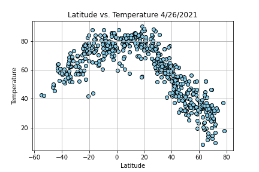

* Humidity (%) vs. Latitude
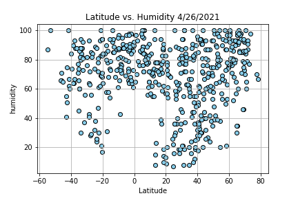

* Cloudiness (%) vs. Latitude
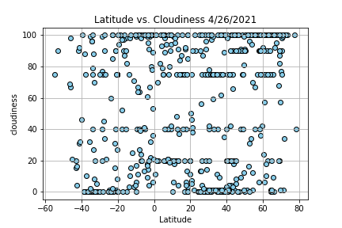

* Wind Speed (mph) vs. Latitude
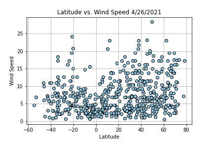

The second section contains code to run linear regression on each relationship. The plots for this are seperated into Northern Hemisphere (greater than or equal to 0 degrees latitude) and Southern Hemisphere (less than 0 degrees latitude):

* Northern Hemisphere - Temperature (F) vs. Latitude
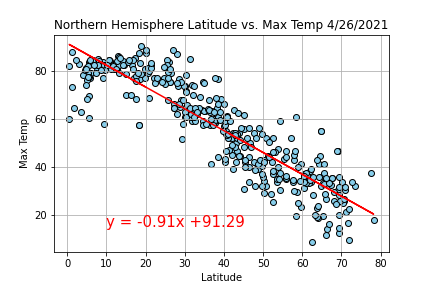

* Southern Hemisphere - Temperature (F) vs. Latitude
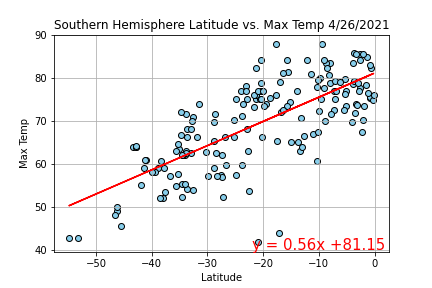

* Northern Hemisphere - Humidity (%) vs. Latitude
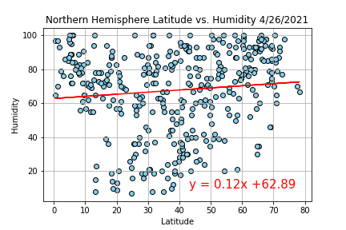

* Southern Hemisphere - Humidity (%) vs. Latitude
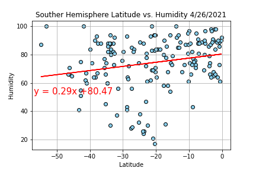

* Northern Hemisphere - Cloudiness (%) vs. Latitude
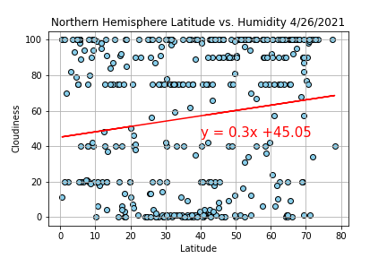

* Southern Hemisphere - Cloudiness (%) vs. Latitude
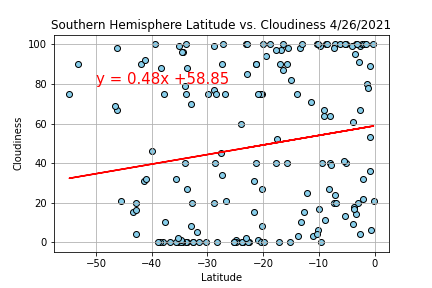

* Northern Hemisphere - Wind Speed (mph) vs. Latitude
.png)

* Southern Hemisphere - Wind Speed (mph) vs. Latitude
.png)

##Part II - VacationPy
The [VacationPy Notebook](./VacationPy.ipynb) contains Python code to analyze weather data to plan future vacations using jupyter-gmaps and the Google Places API.This code contains the following:

* A heat map that displays the humidity for every city from Part I.

* A Narrowed down DataFrame to find ideal weather conditions of:
  * A max temperature lower than 80 degrees but higher than 70.
  * Wind speed less than 10 mph.
  * Zero cloudiness.

* The first hotel for each city located within 5000 meters of the coordinates using Google Places API.
* A Plot of the hotels on top of the humidity heatmap with each pin containing the Hotel Name, City, and Country.

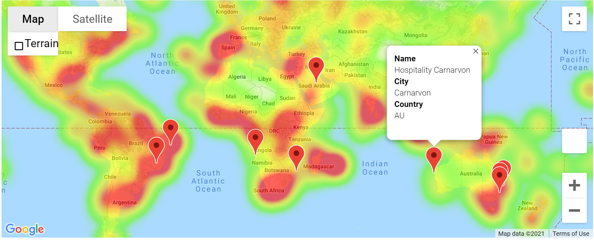
